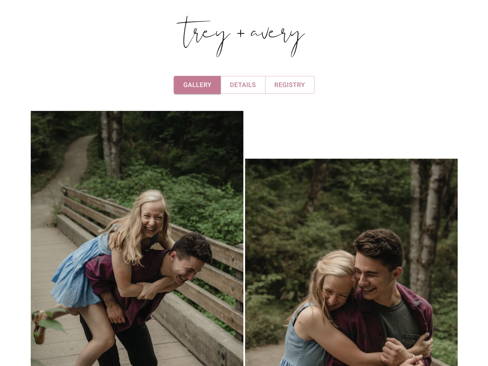

# Moen Wedding Site

## Landing Page


## Information
This is the site for the wedding of myself and Avery (lady friend extraordinaire).
I'm utilizing a combination of TypeScript, Next.js, React, and Material UI. The
application itself is hosted locally using my custom Nginx Docker-compose
setup (coming soon to GitHub).

View it [here](https://staging.owen2moen.com)!

## Environment File (.env)
```bash
IMGIX_API_KEY=''     # A normal Imgix API key
IMGIX_SOURCE_ID=''   # The image source ID seen in your dashboard
```
## Setup
```bash
yarn         # Installs packages
yarn dev     # Run the development server
yarn build   # Export static site
```